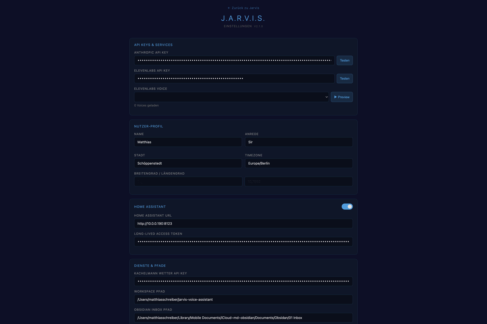

# J.A.R.V.I.S. — Personal AI Voice Assistant (macOS v2.4)

> **This project is based on the original idea and Windows implementation by [Julian Ivanov](https://github.com/Julian-Ivanov/jarvis-voice-assistant).**
> What started as a macOS port has grown into a substantially expanded version — with Home Assistant integration, Apple Reminders, Obsidian, a Config UI, a Dashboard, and a new action system. The core concept, personality, and architecture remain Julian's. No support is provided. This fork is maintained for personal use only.

---

## macOS Adaptations

Built for macOS (Apple Silicon M4) with [Claude Code](https://claude.ai/code). Key differences from the original Windows project:

| Original (Windows) | This Fork (macOS V2.1) |
|--------------------|------------------------|
| Double-clap trigger | Cmd+Shift+J via launchd |
| PowerShell scripts | zsh shell scripts |
| Windows Service | launchd KeepAlive (auto-restarts on crash) |
| Manual task tracking | Apple Reminders via AppleScript (`whose` clause) |
| No smart home | Home Assistant integration (30+ light synonyms) |
| No calendar | iCal via HA CalDAV (today + tomorrow) |
| No notes | Obsidian Inbox (write/read/delete) |
| No config UI | Config UI at `/config` (no text editor needed) |
| No dashboard | Dashboard at `/` (mail, tasks, news, app launcher) |
| Window snapping | Chrome App Mode fullscreen (`--start-fullscreen`) |

---

> Press Cmd+Shift+J. Jarvis wakes up, greets you with the weather and your tasks, answers your questions, controls your browser, and sees your screen.

---

## Screenshots


*Jarvis HUD — voice conversation, mail inbox, tasks, and app launcher*


*Config UI — all settings via browser, no text editor needed*

---

## Features

- **Voice Conversation** — Speak freely in German or English. Jarvis listens, thinks, responds with voice. Echo protection prevents feedback loops.
- **Language Switching** — `language: "de"/"en"` in config switches system prompt, speech recognition locale, TTS phrasing, and all UI labels. No restart required.
- **HUD Click Mute** — Click the animated SVG ring to mute/unmute the microphone. Ring turns red when muted.
- **Text Input Toggle** — Pencil icon in the panel header reveals a text input field for typed commands.
- **Sarcastic British Butler** — Dry, witty personality. Addresses you by your configured title (Sir, Ms. Smith, Chef, …).
- **Weather & Tasks** — On startup: current weather (Kachelmann API + HA weather station) and today's open reminders.
- **Apple Reminders** — Read, add, and complete reminders via AppleScript. Optimistic UI updates — no 25-second freeze.
- **Apple Mail** — Read unread mails on request.
- **Calendar** — Today and tomorrow's events via Home Assistant CalDAV.
- **Home Assistant Lights** — Control lights by room name with 30+ synonyms. Brightness, color, on/off.
- **Obsidian Inbox** — Write notes, read notes, mark notes as done — all by voice.
- **Browser Automation** — Playwright controls a real browser: search, open URLs, read page content.
- **Screen Vision** — Screenshot + Claude Vision: "What's on my screen?"
- **RSS News** — Fetch and read RSS articles by category. Manage feeds via Config UI modal.
- **Daily Brief Memory System** — Event-driven intelligence: morning brief (weather, mails, tasks), pause brief after >30 min, absence brief after >90 min, evening brief from 17:00. Tracks mail IDs so Jarvis stays silent when nothing changed.
- **Wake-from-Sleep** — Waits for screen unlock, then delivers the contextually appropriate brief.
- **In-App Update Badge** — Dashboard shows a badge when a new GitHub release is available.
- **Mic-Mute Menubar** — macOS menubar button to mute/unmute the microphone system-wide.
- **Config UI** — All settings (API keys, voice, language, city, etc.) via browser at `/config`. No text editor.
- **Dashboard** — At `/`: mails, tasks, Obsidian notes, RSS news, app launcher.
- **launchd KeepAlive** — Server auto-restarts on crash. Session launches on login.

---

## Architecture

```
You (speak) → Chrome Browser (Web Speech API de-DE) → FastAPI Server (localhost:8340)
                                                                ↓
                                                       Claude Haiku (thinks)
                                                                ↓
                                           parse_structured_action() [JSON-first]
                                                                ↓
                              ┌─────────────────────┬──────────┴───────────────┐
                              ↓                     ↓                          ↓
                       ElevenLabs TTS        Playwright Browser         AppleScript
                       (speaks back)         (search/open/browse)    (Reminders/Mail)
                              ↓
                       Audio → Chrome → You (hear)
```

| Component | Technology | Purpose |
|-----------|-----------|---------|
| Speech Input | Web Speech API (Chrome, de-DE / en-US) | Voice to text |
| Server | FastAPI (Python 3.11) | Local orchestration |
| Brain | Claude Haiku (Anthropic) | Thinking, deciding, responding |
| Voice | ElevenLabs TTS (eleven_turbo_v2_5) | Natural German speech |
| Browser Control | Playwright | Real browser automation |
| Screen Vision | Claude Vision + Pillow | Screenshot analysis |
| Smart Home | Home Assistant REST API | Light control |
| Reminders/Mail | AppleScript (`whose` clause) | macOS-native task access |
| Auto-start | launchd (KeepAlive + session) | Server + session on login |
| Wake handling | wake-monitor.py → /api/wake | Post-sleep reactivation |

---

## Prerequisites

- **macOS 14+** (Apple Silicon, tested on M4)
- **Python 3.11** via Homebrew (`/opt/homebrew/bin/python3.11`)
- **Google Chrome** (for Web Speech API)
- **Home Assistant** (optional, for lights and CalDAV calendar)

### API Keys Needed

| Service | What For | Link |
|---------|----------|------|
| Anthropic | Claude Haiku (the brain) | [console.anthropic.com](https://console.anthropic.com) |
| ElevenLabs | Voice (TTS, Pro Plan recommended) | [elevenlabs.io](https://elevenlabs.io) |

---

## Quick Start

1. **Clone and install:**
   ```bash
   git clone https://github.com/Black-Shadowcat/jarvis-voice-assistant.git
   cd jarvis-voice-assistant
   /opt/homebrew/bin/pip3.11 install -r requirements.txt
   playwright install chromium
   ```

2. **Create config:**
   ```bash
   cp config.example.json config.json
   ```

3. **Edit `config.json`** — minimum required fields:
   ```json
   {
     "anthropic_api_key": "sk-ant-...",
     "elevenlabs_api_key": "sk_...",
     "elevenlabs_voice_id": "YOUR_VOICE_ID",
     "user_name": "Your Name",
     "user_address": "Sir",          // Male: Sir, Boss | Female: Ms. Smith, Mrs. Johnson, Miss Brown, Madam
     "city": "Your City"
   }
   ```

4. **Start Jarvis:**
   ```bash
   bash scripts/launch-session.sh
   ```

5. Open `http://localhost:8340` in Chrome if it doesn't open automatically.

---

## What You Can Say (German)

| Command | What Happens |
|---------|-------------|
| *"Guten Morgen, Jarvis"* | Weather + today's tasks |
| *"Was steht heute an?"* | Reminders + calendar for today/tomorrow |
| *"Schalte das Wohnzimmerlicht ein"* | HA light control by voice |
| *"Dimme das Licht auf 30%"* | Brightness via Home Assistant |
| *"Suche nach KI-Neuigkeiten"* | Browser opens, searches, summarizes |
| *"Was ist auf meinem Bildschirm?"* | Screenshot + Claude Vision |
| *"Schreib eine Notiz: ..."* | Obsidian Inbox entry |
| *"Meine Erinnerungen"* | Read Apple Reminders aloud |
| *Any question* | Jarvis answers in butler style |

---

## Project Structure

```
jarvis-voice-assistant/
├── server.py              # FastAPI backend — brain + action system
├── browser_tools.py       # Playwright browser automation
├── screen_capture.py      # Screenshot + Claude Vision
├── version.json           # Single source of truth for version number
├── config.json            # Personal config (gitignored)
├── config.example.json    # Template for new users
├── requirements.txt       # Python dependencies
├── locales/
│   ├── de.json            # German TTS strings (greetings, briefs, etc.)
│   └── en.json            # English equivalents
├── systems/
│   └── daily_brief.py     # Daily Brief Memory System (DailyBrief class)
├── data/
│   ├── daily_brief_memory.json   # Daily state (gitignored, resets at midnight)
│   └── daily_brief_archive/      # Past days archive (gitignored)
├── frontend/
│   ├── index.html         # Jarvis Dashboard + HUD (Chrome App Mode, port 8340)
│   ├── config.html        # Config UI (/config)
│   ├── config.js          # Config UI logic
│   ├── handbuch.html      # User manual (/handbuch)
│   └── i18n/
│       ├── de.json        # German UI labels
│       └── en.json        # English UI labels
└── scripts/
    ├── launch-session.sh  # Starts server + Chrome + mic-mute button
    ├── mic-mute-menubar.py # macOS menubar mute toggle
    └── wake-monitor.py    # Wake-from-sleep → /api/wake
```

---

## Important macOS Notes

- **Chrome must be launched via `open -na`**, not the binary directly — launchd-started processes don't inherit the GUI bootstrap context needed for Chrome.
- **AppleScript loops (`repeat with r in every reminder`) are unreliable** for property access — always use `whose` clause filters instead.
- **`result` is a reserved word in AppleScript** — use `taskList` or similar variable names.
- **REMINDER_DONE uses optimistic updates**: removes item from in-memory cache immediately, fires AppleScript in a background thread. Prevents 25-second UI freeze.

---

## launchd Agents

Three agents in `~/Library/LaunchAgents/`:

| Agent | Purpose |
|-------|---------|
| `com.jarvis.server.plist` | FastAPI server with KeepAlive (auto-restarts on crash) |
| `com.jarvis.session.plist` | Session launch on login (Chrome + mic-mute button) |
| `com.jarvis.wake.plist` | Wake-from-sleep monitor |

---

## Troubleshooting

| Problem | Solution |
|---------|----------|
| Server not responding | `pkill -f "server.py"` — launchd restarts it automatically |
| Chrome won't open | Run `bash scripts/launch-session.sh` manually |
| Microphone not working | System Settings → Privacy → Microphone → allow Chrome |
| Reminders not showing | Check server log: `tail -f /tmp/jarvis-server.log` |
| Browser automation fails | Run `playwright install chromium` again |

---

## Tech Stack

- **[FastAPI](https://fastapi.tiangolo.com/)** — Python web framework
- **[Claude Haiku](https://anthropic.com)** — AI model (brain)
- **[ElevenLabs](https://elevenlabs.io)** — Natural text-to-speech
- **[Playwright](https://playwright.dev)** — Browser automation
- **[Web Speech API](https://developer.mozilla.org/en-US/docs/Web/API/Web_Speech_API)** — Browser-native speech recognition
- **[Home Assistant](https://www.home-assistant.io/)** — Smart home integration
- **AppleScript** — macOS Reminders & Mail access

---

## Credits

Original idea and Windows implementation by [Julian Ivanov](https://github.com/Julian-Ivanov) — built with [Claude Code](https://claude.ai/code).
macOS v2.4 — substantially expanded by Matthias Schreiber, also built with [Claude Code](https://claude.ai/code).

Inspired by Iron Man's J.A.R.V.I.S. — *"At your service, Sir."*

---

## License

MIT — use it, modify it, build on it.
